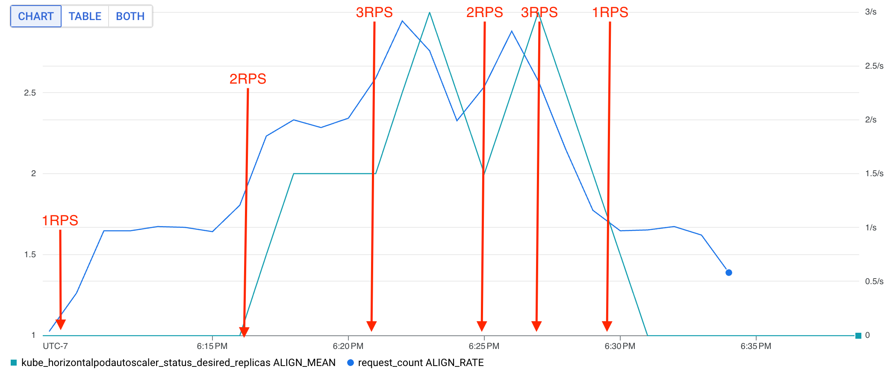

# Step 1 (terraform seed)
Apply the terraform configuration to create the resources in the cloud.

# Step 2 (make sure the cluster is running ant internal load balancers can be created)
Install the following manifests into the cluster to audit load balancer creation with ingress
- [internal-ing.yaml](./manifests/internal-ing.yaml) 
- [web-deploy-yaml](./manifests/web-deploy.yaml)
- [web-svc.yaml](./manifests/web-svc.yaml)

# Step 3 (custom metrics adapter)
Install the custom-metrics-stackdriver-#dapter onto the cluster, this involves severla steps
1. `curl https://raw.githubusercontent.com/GoogleCloudPlatform/k8s-stackdriver/master/custom-metrics-stackdriver-adapter/deploy/production/adapter_new_resource_model.yaml > custom-metrics-stackdriver-adapter.yaml`
2. Add the `--enable-distribution-support=true` flag to the `args` field in the `custom-metrics-stackdriver-adapter.yaml` file
3. `kubectl apply -f custom-metrics-stackdriver-adapter.yaml`

# Step 4 (create the HPA)
1. `kubectl apply -f hpa-rps.yaml`

# Step 5 (create the load test)
1. ssh into the vm and start some curl request loops to stress the load balancer
2. slowly add more and more requests to the load balancer to see the HPA scale up the pods

